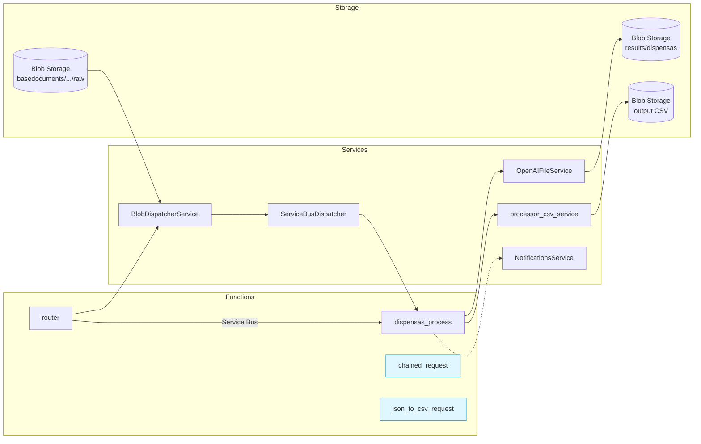

# CAF DispensAI Agent

## Descripción funcional
CAF DispensAI Agent centraliza el procesamiento de dispensas para los proyectos CAF. Los equipos cargan los PDF de respaldo en Azure Blob Storage y disparan el flujo mediante un mensaje en Service Bus. A partir de allí, la plataforma:
- genera tareas por documento;
- coordina la extracción inteligente de datos con Azure OpenAI utilizando prompts controlados por la operación;
- persiste los resultados en formatos JSON y CSV; y
- publica notificaciones de seguimiento cuando corresponde.

Todo ocurre en la nube de Azure, lo que permite trazabilidad por proyecto, ejecución segura y escalable, y reutilización de la lógica de IA entre procesos.

### Flujograma funcional
- **Preparación de insumos**: el proyecto coloca sus documentos en `basedocuments/<project_id>/raw/` dentro del contenedor configurado.
- **Disparo del flujo**: un sistema externo (o los scripts de `tests/`) publica un mensaje en la cola `dispensas-router-in` indicando qué proyecto y qué parámetros (modelo, prompts) se deben usar.
- **Generación de tareas**: la función `router` lista los blobs del proyecto y crea una tarea de procesamiento por documento en la cola `dispensas-process-in`.
- **Extracción con IA**: `dispensas_process` descarga cada PDF, lo envía a Azure OpenAI con el prompt unificado y aplica fallback multimodal si la respuesta está incompleta.
- **Persistencia y agregado**: se guarda un JSON por documento, se actualiza el agregado del proyecto y, cuando todos los archivos están listos, se invoca al servicio que construye/actualiza el CSV.
- **Seguimiento**: se registran eventos en logs y, si hay endpoint configurado, se envían notificaciones de inicio, error y finalización de proceso.

---

Plataforma de procesamiento automatizado de dispensas para CAF basada en Azure Functions y Azure OpenAI. El proyecto usa el programming model v2: todo el registro de funciones vive en `function_app.py` y la lógica de negocio se comparte en el paquete `src/`.

> Con el modelo v2 no existen subcarpetas por función ni `function.json` escritos a mano; los decoradores (`@app.route`, `@app.service_bus_queue_trigger`, etc.) generan la configuración durante el build o el despliegue.

### ¿Qué es el programming model v2?
- Microsoft introdujo este modelo para simplificar la experiencia de desarrollo en Python.
- Las funciones se registran con decoradores en un único archivo (por ejemplo `function_app.py`) en vez de mantener una carpeta por función con `function.json`.
- Durante el build o el publish, Azure Functions genera automáticamente la configuración necesaria a partir del código decorado.
- Esto permite estructurar la lógica como un proyecto Python convencional (paquetes en `src/`) y compartir dependencias entre funciones sin duplicar archivos.

---

## Procesamiento de documentos y extracción de información
- **Entrada**: PDFs almacenados en Blob Storage bajo `basedocuments/<project_id>/raw/`.
- **Orquestación**: un mensaje en Service Bus (`dispensas-router-in`) describe el proyecto y los parámetros opcionales (modelo, prompts, subconjunto de documentos).
- **Generación de tareas**: `router` calcula la lista de blobs y publica un mensaje por documento en `dispensas-process-in`.
- **Extracción**: `dispensas_process` recibe cada tarea, descarga el PDF, lo sube a Azure OpenAI y obtiene la respuesta estructurada (JSON). Se aplica un fallback multimodal con modelo de visión cuando el texto extraído es incompleto.
- **Persistencia**: los JSON individuales se guardan en `basedocuments/<project_id>/results/dispensas/`. También se mantiene un índice agregado (`dispensas_results.json`) y se dispara la generación de CSV cuando un proyecto termina.
- **Notificaciones**: se envían eventos de inicio, error y éxito mediante `NotificationsService` cuando se configuran endpoints externos.

---

## Estructura del repositorio
```
azfunc-MVP-DispensAI/
├── function_app.py                 # Registro de las Azure Functions (HTTP + Service Bus)
├── host.json                       # Configuración global del runtime
├── local.settings.json             # Variables locales (no se despliegan automáticamente)
├── requirements.txt                # Dependencias Python
├── deploy.sh                       # Script de despliegue (envía settings + publica el código)
├── src/
│   ├── interfaces/
│   │   └── blob_storage_interface.py      # Contrato que implementa el repositorio de blobs
│   ├── models/
│   │   ├── dispensa_task.py               # Modelo de cada mensaje en la cola de proceso
│   │   └── queue_message.py               # Modelo del mensaje de orquestación (router)
│   ├── prompts/
│   │   ├── agente_unificado.txt           # Prompt principal para extracción
│   │   ├── agente_clasificador.txt        # Prompt alternativo para clasificación
│   │   └── agente_extractor.txt           # Prompt alternativo para extracción granular
│   ├── repositories/
│   │   └── blob_storage_repository.py     # Implementación concreta de Azure Blob Storage
│   ├── services/
│   │   ├── blob_dispatcher.py             # Calcula documentos por proyecto
│   │   ├── dispensas_processor.py         # Orquestador principal del procesamiento
│   │   ├── notifications_service.py       # Cliente HTTP para notificaciones externas
│   │   ├── openai_chained_service.py      # Ejecuta solicitudes encadenadas sobre OpenAI
│   │   ├── openai_client_factory.py       # Crea clientes autenticados de OpenAI
│   │   ├── openai_file_service.py         # Maneja la subida del PDF y la extracción
│   │   ├── processor_csv_service.py       # Construye/actualiza el CSV consolidado
│   │   └── service_bus_dispatcher.py      # Envía tareas a Service Bus en lotes
│   └── utils/
│       ├── blob_url_parser.py             # Parsea URLs de blobs
│       ├── build_email_payload.py         # Helper para payloads de notificación
│       ├── content_type.py                # Determina nombre y content-type para blobs
│       ├── prompt_loader.py               # Carga prompts desde archivos con fallback a env vars
│       └── response_parser.py             # Normaliza respuestas de OpenAI y extrae texto/JSON
├── tests/                                # Scripts y utilidades para pruebas manuales
│   ├── purge_queue.py                    # Limpia mensajes de las colas de Service Bus
│   ├── router_dispatch_helper.py         # Simula envíos a router/dispensas_process
│   ├── request_with_file_check.py        # Ejecuta OpenAIFileService directamente
│   ├── run_function_checks.py            # Smoke tests sobre los handlers HTTP/Service Bus
│   └── (otros utilitarios)               # Purga de colas, export helpers, etc.
└── devops/, azure-pipelines.yml          # Recursos para CI/CD
```

---

## Flujo de proceso
1. **Orquestación**  
   `router` recibe un mensaje con `project_id`, `trigger_type` y parámetros opcionales (modelo, prompts, subconjunto de documentos).
2. **Descubrimiento de documentos**  
   `BlobDispatcherService` utiliza `BlobStorageRepository` para listar los PDFs bajo `basedocuments/<project_id>/raw/` y construye `DispensaTaskModel` por archivo.
3. **Envío a la cola de proceso**  
   `ServiceBusDispatcher` agrupa las tareas y las publica en `dispensas-process-in`, manejando reintentos y límites de tamaño.
4. **Procesamiento individual (dispensas_process)**  
   - Descarga el PDF desde Blob Storage.  
   - Lo sube a Azure OpenAI mediante `OpenAIFileService`.  
   - Parsea la respuesta para obtener el JSON de dispensas (`response_parser`).  
   - Persiste el resultado por documento y actualiza el agregado (`dispensas_results.json`).  
   - Evalúa si el proyecto completó todos los documentos para disparar `process_dispensia_json_to_csv`.
5. **Generación de CSV**  
   `processor_csv_service` abre `dispensas_results.json`, normaliza campos (fechas, listas) y crea/actualiza un CSV incremental bajo `outputdocuments/<project_id>/...`.
6. **Notificaciones**  
   `NotificationsService` envía mensajes de inicio, error o éxito final cuando hay un endpoint configurado.

```mermaid
flowchart LR
    A[Mensaje en<br/>dispensas-router-in] --> B[router<br/>(Azure Function)]
    B --> C[BlobDispatcherService<br/>+ ServiceBusDispatcher]
    C --> D[Cola dispensas-process-in]
    D --> E[dispensas_process<br/>(Azure Function)]
    E --> F[OpenAIFileService]
    F --> G[JSON por documento<br/>en Blob Storage]
    G --> H[Actualización<br/>dispensas_results.json]
    H --> I[processor_csv_service<br/>(CSV consolidado)]
    E -.-> J[NotificationsService<br/>(opcional)]
```

---

## Componentes principales

### Azure Functions (`function_app.py`)
| Nombre | Tipo | Descripción |
| --- | --- | --- |
| `chained_request` | HTTP POST `/api/chained-request` | Permite ejecutar solicitudes encadenadas contra OpenAI usando un `response_id` previo. Útil para depuración o flujos avanzados. |
| `router` | Service Bus trigger (`dispensas-router-in`) | Entrada principal del pipeline. Traducen mensajes generales en tareas individuales por documento. |
| `dispensas_process` | Service Bus trigger (`dispensas-process-in`) | Núcleo del procesamiento: descarga, envía a OpenAI, persiste JSON, agrega resultados y dispara CSV/notificaciones. |
| `json_to_csv_request` | HTTP POST `/api/json_to_csv_request` | Endpoint auxiliar para reconstruir el CSV desde clientes externos (la función Service Bus también lo invoca internamente). |

> `request_with_file` se eliminó: toda la funcionalidad quedó embebida dentro de `DispensasProcessorService`.

### Servicios destacados
- **OpenAIFileService**: sube PDFs a OpenAI, maneja reintentos, fallback multimodal y cachea resultados en `processed/`.
- **BlobDispatcherService**: interpreta los mensajes de router, normaliza rutas y crea `DispensaTaskModel`.
- **DispensasProcessorService**: orquesta el proceso completo por documento, actualiza agregados, dispara CSV y notificaciones.
- **ProcessorCsvService**: convierte el JSON agregado en un CSV incremental (normaliza fechas, combina filas).
- **OpenAIChainedService**: wrapper ligero para el endpoint de OpenAI que reutiliza `response_id`.
- **NotificationsService**: cliente HTTP configurable para enviar eventos (inicio, error, éxito).
- **ServiceBusDispatcher**: gestiona el envío de tareas a la cola, incluyendo batching y reintentos controlados.

### Modelos y utilidades
- `QueueMessageModel` / `DispensaTaskModel`: validan la forma de los mensajes y exponen helpers de serialización.
- `blob_storage_repository`: encapsula operaciones de lectura/escritura/listado sobre Azure Blob Storage.
- `response_parser`: convierte la respuesta textual de OpenAI en JSON válido y detecta escenarios para fallback.
- `prompt_loader`: permite parametrizar los prompts vía archivos o variables de entorno (fallback).

---

## Prompt principal unificado
El archivo `src/prompts/agente_unificado.txt` define el comportamiento del agente que procesa cada dispensa. Puntos clave de su estructura:
- **Rol y alcance**: instruye al modelo a actuar como analista documental de banca de desarrollo, limitarse a archivos con prefijos `EED`, `CCI` o `STCI` y evitar conclusiones no sustentadas.
- **Contexto dinámico**: `BlobDispatcherService` agrega al final del prompt un bloque `[Contexto de ejecución]` con proyecto CAF, fecha de extracción (UTC) y nombre del archivo. Estos valores deben copiarse tal cual en los campos `codigo_cfa`, `fecha_extraccion` y `fuente_archivo`.
- **Definiciones operativas**: detalla qué se considera dispensa y cómo diferenciarla de una enmienda, además de secciones del documento relevantes (Justificación, Recomendación) y reglas para segmentar múltiples dispensas en un mismo PDF.
- **Clasificación y evidencias**: especifica clusters, categorías, subcategorías, tipos de dispensa y temporalidad; exige evidencias `{page, snippet}` para sustentar cada valor.
- **Estructura de salida**: describe un JSON exacto con raíz `{"proceso": "dispensasCAF", "fuente_archivos": [...], "dispensas": [...]}` en el que cada dispensa incluye identificadores, fechas, clasificación, observaciones y anclas textuales.

Cualquier modificación al prompt debe respetar estos bloques para mantener compatibilidad con `DispensasProcessorService`.



---

## Funciones y agentes
- **Funciones** (Azure Functions) manejan la orquestación, triggers y persistencia. Implementan las interacciones con Service Bus, Blob Storage y OpenAI.
- **Agentes** corresponden a los prompts alojados en `src/prompts/`. Definen el comportamiento del modelo de IA para extraer, clasificar y estructurar la información.
  - `agente_unificado.txt`: prompt principal de extracción.
  - `agente_clasificador.txt`: orientado a taxonomía o validaciones adicionales.
  - `agente_extractor.txt`: alternativa para extracción granular o fallback manual.

Cada prompt puede sobreescribirse por mensaje (`QueueMessageModel`) o mediante variables de entorno (`DEFAULT_AGENT_PROMPT`, `DEFAULT_CHAINED_PROMPT`, etc.). `prompt_loader` intenta primero el archivo indicado y luego la variable inline como respaldo.

---

## Cómo funcionan los agentes (prompts)
1. **Carga dinámica**: `prompt_loader` lee el archivo indicado (por ejemplo, `DEFAULT_AGENT_PROMPT_FILE=agente_unificado.txt`). Si el archivo no existe, usa el contenido en la variable `DEFAULT_AGENT_PROMPT`.
2. **Parámetros de ejecución**: el mensaje del router puede forzar un prompt distinto para un proyecto específico (`agent_prompt`, `chained_prompt`).
3. **Interacción con OpenAI**:
   - `OpenAIFileService` construye un input multimodal (`input_text` + `input_file`).
   - El prompt guía la estructura de salida (esperada como JSON).
   - Si la respuesta está vacía o incompleta, se dispara `_try_with_images` que convierte el PDF a imágenes y usa un modelo de visión (definido en `VISION_MODEL`).
4. **Validación de respuesta**: `response_parser.parse_json_response` intenta deserializar el texto a JSON y maneja errores comunes (caracteres extra, llaves faltantes).

Para actualizar un prompt basta con editar los archivos en `src/prompts/` y desplegar. Para pruebas aisladas se recomienda usar `tests/request_with_file_check.py`, que ejecuta `OpenAIFileService` directamente.

---

## Configuración y variables de entorno
| Clave | Descripción |
| --- | --- |
| `AzureWebJobsStorage` | Storage interno del runtime (Azurite o cuenta real). |
| `FUNCTIONS_WORKER_RUNTIME` | Debe permanecer en `python`. |
| `AZURE_STORAGE_CONNECTION_STRING` | Cuenta de almacenamiento que contiene los PDFs y resultados. |
| `DEFAULT_BLOB_CONTAINER` | Contenedor principal (por defecto `dispensia-documents`). |
| `SERVICE_BUS_CONNECTION` | Conexión a Service Bus con permisos `Send/Listen`. |
| `ROUTER_QUEUE_NAME`, `PROCESS_QUEUE_NAME` | Colas utilizadas (`dispensas-router-in`, `dispensas-process-in`). |
| `AZURE_OPENAI_ENDPOINT`, `USE_API_KEY`, `AZURE_OPENAI_API_KEY` | Credenciales de Azure OpenAI (o configuraciones para AAD). |
| `DEFAULT_OPENAI_MODEL`, `VISION_MODEL` | Modelos usados por el servicio principal y el fallback de visión. |
| `DEFAULT_AGENT_PROMPT_FILE`, `DEFAULT_CHAINED_PROMPT_FILE` | Archivos en `src/prompts/` que cargan los prompts por defecto. |
| `DOCUMENTS_BASE_PATH`, `RAW_DOCUMENTS_FOLDER`, `RESULTS_FOLDER` | Segmentos para organizar blobs (`basedocuments`, `raw`, `results`). |
| `AZURE_STORAGE_OUTPUT_CONNECTION_STRING`, `CONTAINER_OUTPUT_NAME` | Destino donde se escribe el CSV consolidado. |
| `FOLDER_OUTPUT`, `FOLDER_BASE_DOCUMENTS`, `FILENAME_JSON`, `FILENAME_CSV` | Ubicación y nombres de los artefactos finales. |
| `NOTIFICATIONS_API_URL_BASE`, `SHAREPOINT_FOLDER` | Configuración opcional para notificaciones externas. |

> Durante la migración se eliminaron las claves `INTERNAL_API_*`. No son necesarias en la nueva arquitectura.

---

## Persistencia y organización en Blob Storage
La estructura de directorios se controla mediante `DOCUMENTS_BASE_PATH`, `RAW_DOCUMENTS_FOLDER` y `RESULTS_FOLDER` (por defecto `basedocuments`, `raw`, `results`). Por proyecto se utilizan los siguientes prefijos:

```text
basedocuments/<project_id>/raw/               # Documentos de entrada (PDFs)
basedocuments/<project_id>/processed/         # Respuestas originales de OpenAI (response_id + content)
basedocuments/<project_id>/results/dispensas/ # JSON por documento procesado
basedocuments/<project_id>/results/           # Archivos auxiliares del proyecto
    ├── dispensas_results.json                # Agregado con todas las dispensas del proyecto
    ├── .info_start.sent                      # Marcador de notificación de inicio
    ├── .csv_generation.lock / csv_generation.done
    └── outputdocuments/<...>/<FILENAME_CSV>  # CSV consolidado (según FOLDER_OUTPUT/FILENAME_CSV)
```

- **Processed**: `OpenAIFileService` guarda `processed/<documento>.json` con el `response_id` y el texto completo devuelto por OpenAI para depuración.
- **Results/dispensas**: `DispensasProcessorService` almacena el JSON parseado listo para consumo aguas abajo.
- **Results/root**: contiene el agregado (`dispensas_results.json`), marcadores de estado y el CSV final generado por `process_dispensia_json_to_csv`.
- Las rutas se parametrizan por entorno; cualquier cambio en los nombres debe reflejarse en las variables de configuración antes del despliegue.

---

## Ejecución local
1. Clona el repositorio y crea un entorno virtual (Python 3.11 recomendado).
2. Instala dependencias: `pip install -r requirements.txt`.
3. Completa `local.settings.json` con los valores de Storage, Service Bus y OpenAI. **No** lo subas al repositorio.
4. Ejecuta `func start --python` (puedes definir el puerto con `--port 7071`).
5. Usa `tests/router_dispatch_helper.py` para simular mensajes:
   ```bash
   python3 tests/router_dispatch_helper.py CFA001234
   ```
   Los resultados se almacenarán en el contenedor configurado (`basedocuments/<project>/results/dispensas/`).

Otros scripts útiles:
- `tests/purge_queue.py`: limpia mensajes pendientes en Service Bus.
- `tests/run_function_checks.py`: smoke tests rápidos sobre los handlers.
- `tests/request_with_file_check.py`: Ejecuta `OpenAIFileService` directamente con un documento de ejemplo.

---

## Despliegue
El repositorio incluye `deploy.sh`, que automatiza tres pasos:
1. Envía los Application Settings a la Function App usando `local.settings.json`.
2. Publica el código con `func azure functionapp publish`.
3. Reinicia la Function App para aplicar los cambios.

Uso:
```bash
./deploy.sh <function_app_name> <resource_group> [subscription_id]
```
Asegúrate de haber ejecutado `az login` y de tener instalado Azure CLI, Azure Functions Core Tools y Python 3.

---

## Pruebas y validaciones sugeridas
- **Función router**: usar `router_dispatch_helper.py` con un proyecto pequeño y verificar que se envíen los mensajes correctos a `dispensas-process-in`.
- **Procesamiento completo**: monitorear `func start` (o el logstream en Azure) y confirmar que se escriben JSON individuales, `dispensas_results.json` y el CSV final.
- **Fallback de visión**: provocar un JSON vacío o un PDF difícil de leer para verificar que `_try_with_images` se ejecuta.
- **Notificaciones**: configurar temporalmente `NOTIFICATIONS_API_URL_BASE` y validar que llegue un mail/POST en los eventos esperados.

---

## Próximos pasos
1. Implementar la función `csv_global` para orquestar la consolidación de todos los proyectos desde un único trigger.
2. Automatizar pruebas end-to-end (via pipelines o scripts) que cubran el flujo completo desde router hasta CSV.
3. Integrar dashboards/alertas que midan duración por documento, cantidad de reintentos y estado de notificaciones.
4. Revisar con el equipo de arquitectura el uso de Durable Functions si se requiere un control más fino sobre reintentos o pasos largos.

---

## Referencias
- Proyecto original de donde se portó la lógica inicial de `request_with_file` y `chained_request`.
- Documentación de Azure Functions (Programming model v2) y Azure OpenAI para la actualización de SDKs y autenticación.
- Mantener las llaves sensibles (Storage, Service Bus, OpenAI) en App Settings o Key Vault; rotarlas antes de cada despliegue relevante.
